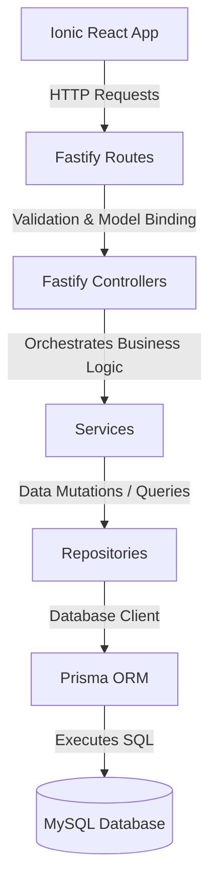

# System Architecture & Design Guidelines

This document defines the high-level architecture, layer responsibilities, and system topology of the Insurance Tracker platform. Every AI coding agent must strictly adhere to these patterns.

---

## 1. Clean & Layered Architecture

The application is structured around a strict layered architecture with clear boundaries of concern. No layer is allowed to bypass its immediate neighbor.

### Layer Responsibilities

| Layer            | Primary Responsibility                                                                                                                         | Strict Boundaries / Constraints                                                            |
| :--------------- | :--------------------------------------------------------------------------------------------------------------------------------------------- | :----------------------------------------------------------------------------------------- |
| **Routes**       | Registration of HTTP endpoints, schema-based request validation hook configuration.                                                            | No business logic. No direct service calls.                                                |
| **Controllers**  | Extraction of parameters (body, query, headers), calling the appropriate service(s), formatting and returning the standard response structure. | No business logic. Never access Prisma or Repositories directly.                           |
| **Services**     | Domain business logic implementation, transaction management, data transformation, service orchestration, external API calls.                  | Never access the database directly without going through a Repository. Framework-agnostic. |
| **Repositories** | Prisma query execution, raw database statements (if ever needed), data-level query optimization.                                               | No business logic or validation. Cannot call other services or controllers.                |
| **Prisma/DB**    | Data persistence, mapping relations, foreign key and index enforcement.                                                                        | Schema definition only.                                                                    |

---

## 2. Directory Layouts

### Backend (apps/api)

All api logic resides in `apps/api/src/`. Keep code separated cleanly:

- `config/`: App configuration driven by environment variables.
- `controllers/`: Thin handlers binding requests to services.
- `database/`: Database client singleton provider.
- `errors/`: Custom error classes extending a base `AppError`.
- `middlewares/`: Fastify hooks (authentication, rate-limiting, CORS, global error handling).
- `plugins/`: Core fastify plugins registration.
- `repositories/`: Pure Prisma database access operations.
- `routes/`: Endpoint mapping and fastify schema validation bindings.
- `schemas/`: Input validation and output serialization schemas (Zod or Fastify JSON-Schema).
- `services/`: Business rules, authorization checking, transactional operations.
- `utils/`: Reusable helpers specific to the API.

### Frontend (apps/mobile)

All UI logic resides in `apps/mobile/src/`:

- `components/`: Reusable, domain-agnostic UI presentation components (layout, primitives).
- `features/`: Feature-sliced folders containing related services, hooks, and components.
- `hooks/`: Global, reusable state/interaction custom hooks.
- `pages/`: Route-level entry points.
- `services/`: Global API client instances (Axios) and utility services.

---

## 3. High Cohesion & Low Coupling Principles

- **Explicit Boundaries**: Shared library code inside `packages/*` must remain domain-agnostic and fully independent of specific application logic.
- **No Direct File Imports**: Applications must never reach into another package's internal files. All imports must utilize packages' entry points (e.g., `@repo/types`, `@repo/utils`, `@repo/ui`).
- **Framework Separation**: Separate UI code from data management and logic. React components should be presentation-first, outsourcing state fetching to TanStack Query custom hooks and business transformations to services/helpers.
